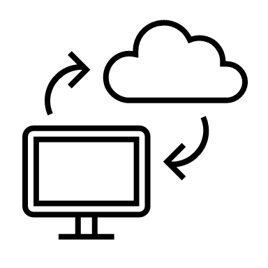

# 02_NETWORK

### 컴퓨터 통신( Network )의 역사

네트워크는 **1. Network Edge**, **2. Network Core**로 구성

Network Edge : 네트워크 끝에 위치해서 실제로 사용하는 것 ( 스마트폰, 이더넷, 서버 )

Network Core : 확장성 ( 어떻게 더 많은 단말을 연결할지 ) 위주로 발달

#### Network Edge의 역사

Last Mile : Network Core에서 네트워크 끝에 위치한 Network Edge까지 연결시 마지막 단계

Last Mile을 발전 시키며, Network Edge 가 발전

1.  Dial-Up Modem

	- 전화선을 그대로 이용해 통신
	- 음성정보 이용
	- Binary Data -> 가청주파수 로 변경하여 통신
	- 큰 데이터를 전송하지 못 하거나 많은 비용 요구
	- 1200 bps ~ 9600 bps 전송률 
	- Network Core는 전화망

2.  DSL (  Digital Subscriber Line)

	- Last mile만 전화선을 이용하여 통신 
	- Network Core는 별도로 존재
	- 1 mbps ~ 8 mbps 전송률
	- 음악, 동영상 스트리밍 가능
	- 전화선을 이용하여 통신해 자신만의 통신선 사용

3. Cable Modem

	- 전화선 대신 케이블 티비 선로( 동축선 )를 이용하여 통신
	- 최대 30 mbps 전송률
	- 혼자 쓰는 전화선로에 비해 같이 쓰는 케이블 티비 선로가 data 전송률이 떨어지는 경우가 존재

4. FTTH ( Fiber to The Home )

	- 집앞까지 광케이블이 존재
	- 구리선에서 광섬유로 발전

|           | 구리선         | 광섬유             |
| --------- | -------------- | ------------------ |
| 신호      | 전기적 신호    | 전자기파 가시 광선 |
| 잡음 여부 | 잡음에 취약    | 잡음 특성 우수     |
| 비용      | 관리 비용 낮음 | 관리 비용 높음     |
| 대역폭    | 낮음           | 높음               |

